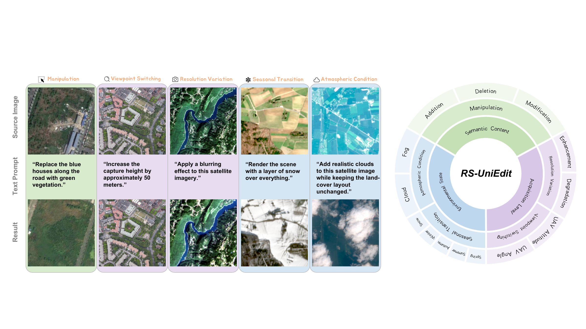

# RS-UniEdit

[](https://www.kaggle.com/datasets/rsuniedit/rs-uniedit)



RS-UniEdit is a remote sensing image editing dataset covering five editing tasks:
content, resolution, season, atmosphere, and viewpoint. This repository contains
the data generation scripts and evaluation scripts used to build and assess the
dataset.

## Repository Layout

```text
assets/
  N1(4).pdf
  overview.png
scripts/
  generation/
    content.py
    resolution.py
    season.py
    atmosphere.py
    viewpoint.py
  metrics/
    fid.py
    clip_score.py
    lpips_dists.py
requirements.txt
LICENSE
```

## Data Generation

The generation scripts assume local source datasets and an OpenAI-compatible
LLM endpoint for instruction generation. Configure paths and model settings with
environment variables such as `LEVIR_ROOT`, `SECOND_ROOT`, `SEN2_ROOT`,
`OLI2MSI_ROOT`, `SEASONET_ROOT`, `SUES200_ROOT`, `RRSHID_ROOT`, `SEN12MS_ROOT`,
`OPENAI_BASE_URL`, `OPENAI_API_KEY`, and `RS_UNIEDIT_LLM_MODEL`.

```bash
python scripts/generation/content.py
python scripts/generation/resolution.py
python scripts/generation/season.py
python scripts/generation/viewpoint.py
```

Atmosphere generation contains both the RRSHID fog/haze builder and the
SEN12MS-CR cloud builder in one script:

```bash
python scripts/generation/atmosphere.py fog
python scripts/generation/atmosphere.py cloud
python scripts/generation/atmosphere.py all
```

`all` runs the fog/haze stage first, then appends the cloud records.

## Evaluation

The metric scripts take the generated result, ground-truth target, and original
source image paths, then print scores directly in the terminal.

```bash
python scripts/metrics/clip_score.py \
  --result path/to/result.png \
  --target path/to/target.png \
  --source path/to/source.png

python scripts/metrics/lpips_dists.py \
  --result path/to/result.png \
  --target path/to/target.png \
  --source path/to/source.png

python scripts/metrics/fid.py \
  --result path/to/result_images \
  --target path/to/target_images \
  --source path/to/source_images
```

`clip_score.py` reports CLIP-I and CLIP-Directional. `lpips_dists.py` reports
LPIPS and DISTS. `fid.py` reports FID and is intended for image directories.
